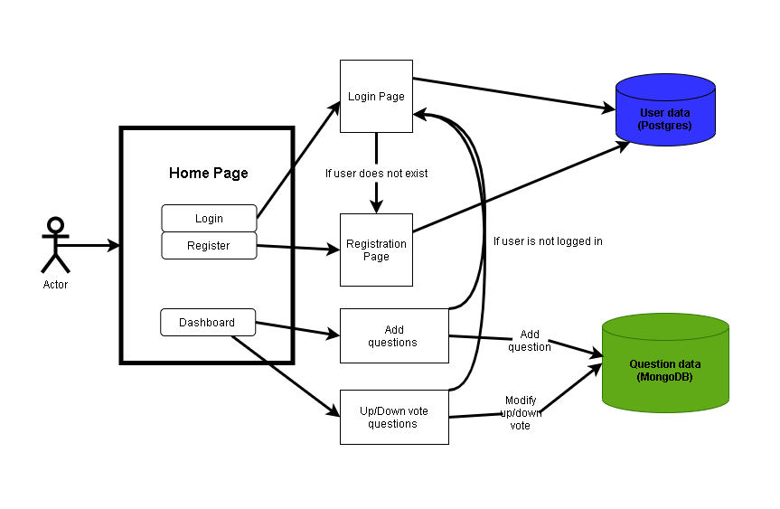

# StackQFlow

## Progressive-Project-Team-4

## Teams :

- Krishna
- Sailaja
- Aneesha
- Bitan

# Week 1

## Progressive Project Structure :

## User Stories for Week 1

- Application should have option to login to system

- Application should allow to register

- Application should allow registered user to ask question

- There should be UP / DOWN vote to a question

Postgres-SQL:
TABLE: users
- UID   userName	 password	email(unique)	gender(option)	   facebookLink	instaLink	linkedinLink
- U001    krishna  password   s@g.com         M/F/Others       optional    optional    optional
- U002    krishna  password   g@g.com

Login.html
- email 
- password

COLEECTION: Questions
- QID	  question	        upVotes	 downVotes	 Timestamp	        closed/open	 UID    AID
- Q001    "description"    count    counts      time of posting    closed     U001    {A001, A002}

COLLECTION: Answers
- AID     QID     Answer  upVotes downVotes   TimeStamp       UID 
- A001    Q001    " "     count     count     "date+time"     U001
- A002    Q002
- A003    Q001